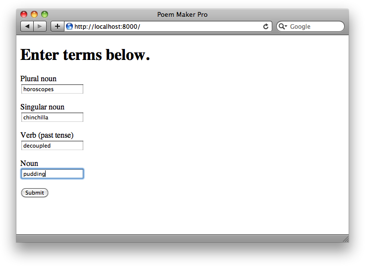
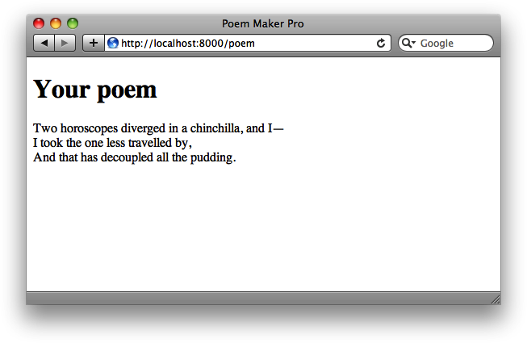
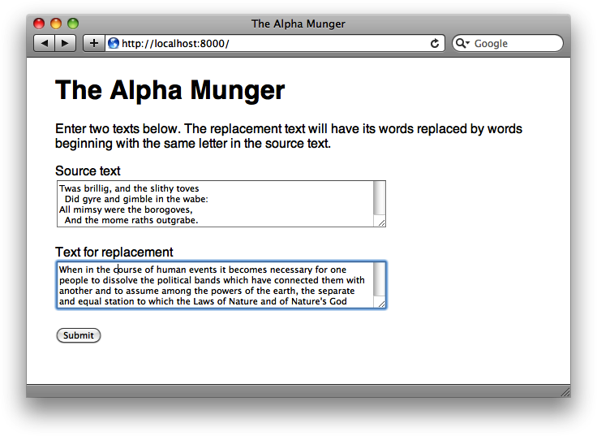
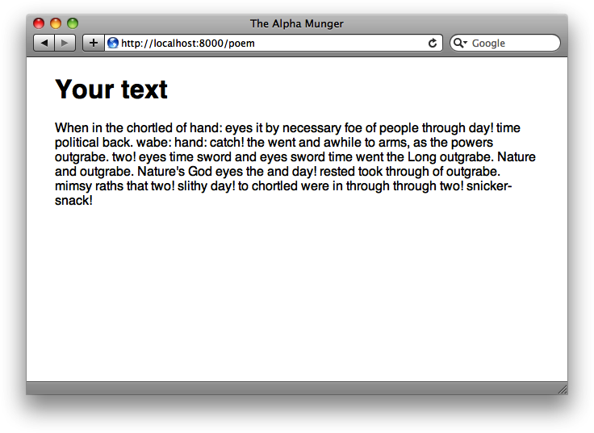

#第二章

**表单和模板**

**Forms and Templates**

在第一章里，我们考察了使用Tornado建立一个web应用的基本知识。涵盖了处理器（handlers）、HTTP请求方式以及Tornado框架的整体架构。在本章中，我们将探究一些在构建web应用时可能会用到的更为强大的特性。

和其它web框架一样，Tornado的一个主要目标就是**帮助使用者更快地写出应用**，尽可能**干净地重用更多代码**。Tornado具备足够的灵活性，允许开发者使用将近所有Python所支持的模板语言，她本身就在`tornado.template`模块中包含有一个轻量快速灵活的模板语言（While Tornado is flexible enough to allow you to use nearly any template language supported by Python, it contains a lightweight, fast, and flexible templating language within the `tornado.template` module）。

##简单示例：诗歌制造专家

**Simple Example: Poem Maker Pro**

让我们以一个叫做*Poem Maker Pro*的简单示例开始。Poem Maker Pro是一个提供了用户去填写的表单的web应用，然后处理出那个表单的结果。示例2-1给出了Python代码。

*示例2-1, 简单表单和模板：poemmaker.py*

```python
#!/usr/bin/env python2.7
# -*- coding: utf-8 -*-

import os.path

import tornado.httpserver
import tornado.ioloop
import tornado.options
import tornado.web

from tornado.options import define, options
define("port", default=8000, help="run on the given port", type=int)


class IndexHandler(tornado.web.RequestHandler):
    def get(self):
        self.render('index.html')


class PoemPageHandler(tornado.web.RequestHandler):
    def post(self):
        noun1 = self.get_argument('noun1')
        noun2 = self.get_argument('noun2')
        noun3 = self.get_argument('noun3')
        verb = self.get_argument('verb')
        self.render('poem.html', roads=noun1, wood=noun2, made=verb,
                difference=noun3)


if __name__ == "__main__":
    tornado.options.parse_command_line()
    app = tornado.web.Application(
        handlers=[(r'/', IndexHandler), (r'/poem', PoemPageHandler)],
        template_path=os.path.join(os.path.dirname(__file__), "templates")
        )
    http_server = tornado.httpserver.HTTPServer(app)
    http_server.listen(options.port)
    tornado.ioloop.IOLoop.instance().start()
```

除*poemmaker.py*外，还需要位于名为*templates*子目录下的示例2-2及2-3中展示的两个文件。

*例2-2, Poem Maker表单: index.html*

```html
<!DOCTYPE html>
<html>
    <head><title>Poem Maker Pro</title></head>
    <body>
        <h1>Enter terms below.</h1>
        <form method="post" action="/poem">
        <p>Plural noun<br><input type="text" name="noun1"></p>
        <p>Singular noun<br><input type="text" name="noun2"></p>
        <p>Verb (past tense)<br><input type="text" name="verb"></p>
        <p>Noun<br><input type="text" name="noun3"></p>
        <input type="submit">
        </form>
    </body>
</html>
```

*例2-3, Poem Maker模板：poem.html*

```html
<!DOCTYPE html>
<html>
    <head>
        <title>Poem Maker Pro</title>
        <meta http-equiv="Content-Type" content="text/html; charset=UTF-8" />
    </head>
    <body>
        <h1>你的诗歌</h1>
        <p>Two {{roads}} deverged in a {{wood}}, and I&mdash;<br>
        I took the one less travelled by,<br>
        And that has {{made}} all the {{difference}}
        </p>
    </body>
</html>
```

此时在命令行像这样运行本程式。

`$ python poemmaker.py --port=8000`

现在，将web浏览器指向`http://localhost:8000`。在web浏览器请求根资源（“/”）时，该Tornado程式就会渲染*index.html*，显示出图2-1中的简单HTML表单。



*图2-1, Poem Maker Pro: 输入表单*

该表单包含了一个文本字段（分别被命名为`noun1`、`noun2`等等），在用户点击`提交`按钮时，这些字段的内容将以一个`POST`请求方式，发送给`/poem`。现在填写这些字段并点击提交。

作为对那个`POST`请求的响应，该Tornado应用对*poem.html*文件进行渲染，将输入到表单中的值插入进该html文件。结果就是稍微修改过的Robert Frost的“The Road Not Taken”的一个小节。图2-2显示了结果的样子。



*图2-2, Poem Maker Pro: 输出*

**参数`template_path`告诉Tornado到哪里去找模板文件**（*template files*）。在本章及第3章中，都会学到模板文件的准确性质和语法（the exact nature and syntax of templates files）。但其基本要义就是：**模板就是一些可以嵌入小Python代码片段的HTML文件**（templates are HTML files that allow you to embed snippets of Python code）。前面的代码告诉Python在一个位于Tornado应用程序文件相同目录下，名为*templates*的目录中查找模板文件。

而一旦告诉了Tornado到哪里找到这些模板，就可以使用`RequestHandler`类的`render`方法，告诉Tornado去读取一个模板文件，插入在该模板文件总找到的**模板代码**(template code), 接着就将渲染结果发送给浏览器。比如在`IndexHandler`中，就找到下面的代码。

```python
self.render('index.html')
```

这条代码将引发Tornado去找到*templates*目录中的*index.html*文件，读取其内容，然后将其发送给浏览器。

###关于插入

**Interpolation**

结果证明*index.html*根本就不叫”模板“，其包含的完全就是预先制作好的HTML标签（It turns out that *index.html* is hardly a "template" at ll, seeing that it consists entirely of prebaked HTML markup）。这是一个模板的很好用法，但通常我们想要**在HTML输出中结合上程式所传递给模板的一些值**。而为`PoemPageHandler`所渲染的*poem.html*这个模板，就是一个好的例子，我们来看看其是如何工作的。

在文件*poem.html*中，在模板中可以看到几个**用双花括号括起来的字串**，就像这样。

```html
        <p>Two {{roads}} deverged in a {{wood}}, and I&mdash;<br>
        I took the one less travelled by,<br>
        And that has {{made}} all the {{difference}}</p>
```

以双花括号括起来的单词，就叫**占位符**（placeholders），这些就是我们打算在渲染模板时用真实值替换的。通过将关键字参数（keyword arguments）传入给`render`函数，就可以指定哪些值要插入到HTML的哪些位置，而这些关键字是与那些占位符的名称对应的。下面就是`PoemPageHandler`中与此有关的代码部分。

```python
        noun1 = self.get_argument('noun1')
        noun2 = self.get_argument('noun2')
        noun3 = self.get_argument('noun3')
        verb = self.get_argument('verb')
        self.render('poem.html', roads=noun1, wood=noun2, made=verb,
                difference=noun3)
```

这里，我们告诉模板，使用变量`noun1`(它是从`get_argument`方法得到的)作为模板中`roads`的值，变量`noun2`作为模板中`wood` 的值，等等。假设用户在表单中输入了`pineapples`、`grandfather clock`、`irradiated`及`supernovae`，那么结果的HTML将会想这样。

```html
<p>Two pineapples diverged in a grandfather clock, and I&mdash;<br>
I took the one less travelled by,<br>
And that has irradiated all the supernovae.</p>
```

##模板语法

**Template Syntax**

既然已经在上面的例子中碰到了一个简单的模板实例，就来进一步探究一下模板的原理吧。Tornado中的模板，是一些**用Python表达式及控制序列所标记了的简单文本文件**。而Tornado模板的语法，是相当简单直接的（Templates in Tornado are simply text files marked up with Python expressions and control sequences. The syntax of Tornado templates is fairly straightforward and simple）。对Django、Liquid或其它类似框架熟悉的用户，将找到很多的相似之处，并会发现Tornado模板是容易上手的。

在”Simple Example: Poem Maker Pro“中，我们已经展示了在web应用中，如何使用`render`方法将HTML发送给浏览器。你可以在Tornado应用之外，通过在Python解释器下导入模板模块（the template module）, 以直接打印出输出的方式，对模板系统（the templating system）进行试用。

```python
>>> from tornado.template import Template
>>> content = Template("<html><body><h1>{{ header}}</h1></body></html>")
>>> print content.generate(header="欢迎！")
<html><body><h1>欢迎！</h1></body></html>
```

###插入表达式

**Interpolating Expressings**

示例2-1演示了使用双花括号来将一些Python变量插入到模板中。实际上**可将任何的Python表达式放进双花括号中**。Tornado将把包含表达式运算结果的字串插入到输出中。下面有一些几个可能的例子。

```python
>>> from tornado.template import Template
>>> print Template("{{ 1+1 }}").generate()
2
>>> print Template("{{ 'scrambled eggs'[-4:]}}").generate()
eggs
>>> print Template("{{ ', '.join([str(x*x) for x in range(10)]) }}").generate()
0, 1, 4, 9, 16, 25, 36, 49, 64, 81
```

###控制流语句

**Control Flow Statements**

同样**可以在Tornado模板中包含Python条件及循环语句**（Python conditionals and loops）。而控制语句是**要用``包围起来**的。就像下面这样进行使用。

```python

```

或者

```python

```

大部分控制语句都只是与其对应的Python语句一样工作，支持`if`、`for`、`while`及`try`。在这些情况下，代码块以``结束。

那么有这么一个模板。

```html
<html>
	<head>
		<title>{{ title }}</title>
	</head>
	<body>
		<h1>{{ header }}</h1>
		<ul>
			
			<li>{{ book }}</li>
			
		</ul>
	</body>
</html>
```

在被下面的Tornado应用程式调用时。

```python
#!/usr/bin/env python2.7
# -*- coding: utf-8 -*-

import os.path

import tornado.httpserver
import tornado.ioloop
import tornado.options
import tornado.web

from tornado.options import define, options
define("port", default=8001, help="在指定端口上运行", type=int)

class BookHandler(tornado.web.RequestHandler):
    def get(self):
        self.render(
            "book.html",
            title = "主页",
            header = "伟大的书籍",
            books = [
                     "Learning Python",
                     "Programming Collective Intelligence",
                     "Restful Web Services"
                     ]
        )


if __name__ == "__main__":
    tornado.options.parse_command_line()
    app = tornado.web.Application(
        handlers=[(r'/', BookHandler)]
    )
    http_server = tornado.httpserver.HTTPServer(app)
    http_server.listen(options.port)
    tornado.ioloop.IOLoop.instance().start()
```

就会渲染出下面的输出。

```html
<html>
    <head>
    <title>主页</title>
    </head>
    <body>
        <h1>伟大的书籍</h1>
        <ul>

            <li>Learning Python</li>

            <li>Programming Collective Intelligence</li>

            <li>Restful Web Services</li>

        </ul>
    </body>
</html>
```

Tornado的模板语言最好的一项功能是，与许多其它Python模板系统（other Python templating systems）不一样，**对在`if`及`for`代码块中所使用的表达式没有限制**。因此，在模板中可以执行完全的Python代码。

还可以在控制代码块中间，使用``的形式，设置一些变量。在代码块中就可以做很多事情，但在大多数情况下，通过利用那些**UI模块**，就可以很好地解决复杂问题（There's plenty more you can do just within control blocks, but in most cases, you'll be better served by making use of **UI modules** to do more complex breakdowns for you）。很快就会讨论这个问题。

###使用位于模板内的函数

**Using Functions Inside Templates**

Tornado在所有模板中都提供了一些有用的函数。包括下面这些。

+ `escape(s)`
    - 用相应的HTML字符实体（HTML entities）对字串 `s` 中的`&`、`<`及`>`进行替换。
+ `url_escape(s)`
    - 运用`urllib.quote_plus`来将字串 `s` 中的字符替换成其URL编码的对等形式。
+ `json_encode(val)`
    - 将`val`编码为JSON。（揭开表象看本质(underneath the hood), 这就是对`json`库中`dumps`函数的调用。阅读有关文档来了解该函数所接受参数及返回值的类型）
+ `squeeze(s)`
    - 对字串 `s` 进行过滤，将连续的多个空格，替换为一个空格

> 在Tornado 1.x中，模板不会被自动编码（templates are not automatically escaped）。而在Tornado 2.0中，模板自动编码（template autoescaping）默认是开启的(同时可以通过将`autoescape=None`参数传递给`Application`构建器将其关闭)。所以在从一个版本迁移到另一版本时，要注意向后兼容性问题。

使用一个在模板内部编写的函数是容易的：将函数名称作为一个模板参数传入即可，跟所有其它变量一样。

```python
>>> from tornado.template import Template
>>> def disemvowel(s):
...     return ''.join([x for x in s if x not in 'aeiou'])
...
>>> disemvowel("george")
'grg'
>>> print Template("my name is {{ d('mortimer') }}").generate(d=disemvowel)
my name is mrtmr
```

##完整例子：The Alpha Munger

在例2-4中，将把本章所谈到的所有知识放在一起。所描述的应用名为*The Alpha Munger*。用户输入两段文本：一段“源”文本，一段“替换”文本。应用就会返回一个“替换”文本的拷贝，其中所有单词都已由源文本中与其有着同样开始字母的单词替换掉了。图2-3显示了填写完毕的表单，图2-4显示了文本结果。

该应用由4个文件组成：*main.py*(Tornado程式)、*style.css*(一个CSS样式表文件)，以及*index.html*和*munged.html*(Tornado模板)。来探究一下代码。

```python
#!/usr/bin/env python2.7
# -*-coding: utf-8-*-
import os.path
import random

import tornado.httpserver
import tornado.web
import tornado.ioloop
import tornado.options

from tornado.options import define, options
define("port", default=8001, help="run on the given port", type=int)


class IndexHandler(tornado.web.RequestHandler):
    def get(self):
        self.render('index.html')


class MungedPageHandler(tornado.web.RequestHandler):
    def map_by_first_letter(self, text):
        mapped = dict()
        for line in text.split('\r\n'):
            for word in [x for x in line.split(' ') if len(x) > 0]:
                if word[0] not in mapped: mapped[word[0]] = []
                mapped[word[0]].append(word)
        return mapped

    def post(self):
        source_text = self.get_argument('source')
        text_to_change = self.get_argument('change')
        source_map = self.map_by_first_letter(source_text)
        change_lines = text_to_change.split('\r\n')
        self.render('munged.html', source_map=source_map,
                change_lines=change_lines, choice=random.choice)

if __name__ == '__main__':
    tornado.options.parse_command_line()
    app = tornado.web.Application(
        handlers=[(r'/', IndexHandler), (r'/poem', MungedPageHandler)],
        template_path=os.path.join(os.path.dirname(__file__), "templates"),
        static_path=os.path.join(os.path.dirname(__file__), "static"),
        debug=True
    )
    http_server = tornado.httpserver.HTTPServer(app)
    http_server.listen(options.port)
    tornado.ioloop.IOLoop.instance().start()
```



*图2-3, Alpha Munger: 输入表单*



*图2-4, Alpha Munger: 输出*

要**注意`Application`构建器的`static_path`参数**。接下来会详细说明这个参数，但目前需要知道的就是，`static_path`参数指定了一个程序用以保留其静态资源（如图像、CSS文件、JavaScript文件等）的目录。也需在名为*templates*的目录中有*index.html*及*munged.html*这两个文件（在例2-5和2-6中列出）。

*例 2-5, Alpha Munger表单：index.html*

```html
<!DOCTYPE html>
<html>
    <head>
        <link rel="stylesheet" href="{{ static_url("style.css") }}">
        <title>The Alpha Munger</title>
    </head>
    <body>
        <h1>The Alpha Munger</h1>
        <p>Enter two texts below. The replacement text will have its words
        replaced by words beginning with the same letter in the source text.</p>
        <form method="post" action="/poem">
        <p>Source text<br>
            <textarea rows=4 cols=55 name="source"></textarea></p>
        <p>Text for replacement<br>
            <textarea rows=4 cols=55 name="change"></textarea></p>
        <input type="submit">
        </form>
    </body>
</html>
```

*例 2-5, Alpha Munger模板：munged.html*

```html
<!DOCTYPE html>
<html>
    <head>
        <link rel="stylesheet" href="{{ static_url("style.css") }}">
        <title>The Alpha Munger</title>
    </head>
    <body>
        <h1>Your text</h1>
    <p>

    
        
            <span class="replaced"
                title="{{word}}">{{ choice(source_map[word[0]]) }}</span>
        
            <span class="unchanged" title="unchanged">{{word}}</span>
        
    
            <br>

        </p>
        <p>{{ mapped }}</p>
    </body>
</html>
```

最后，用例2-7中的内容制作一个名为*style.css*的文件，并将其放入名为*static*的子目录中。（很快就会讨论到使用*static*子目录的原因。）

例 2-7, Alpha Munger样式表：style.css*

```css

body {
    font-family: Helvetica,Arial,sans-serif;
    width: 600px;
    margin: 0 auto;
}
.replaced:hover { color: #00f; }
```

###原理

此Tornado应用定义了两个请求处理器类（two request handler class）: `IndexHandler`和`MungedPageHandler`。类`IndexHandler`简单地渲染了*index.html*中的模板，其中包含了允许用户`POST`一则源文本（位于名为`source`的字段中）及一则要改变的文本（位于名为`change`的字段）到`/poem`页面的表单。

而`MungedPageHandler`则是建立用来处理这些到`/poem`的请求。在请求到达时，该处理器对进入的数据执行一些基本的处理，接着就将一个模板渲染给浏览器。方法`map_by_first_letter`将进入文本（来自`source`字段）分割成单词，尔后创建出一个其中关联了字母及源文本中那些以该字母开头的单词的字典（将该字段放入到名为`source_map`的变量）。接着就将该字典与用户所指定的用于替换的文本（位处表单的`change`字段），传递给模板`munged.html`。此外，还将Python标准库的`random.choice`函数也传入进去，该函数从取得的列表返回一个随机列表元素。
