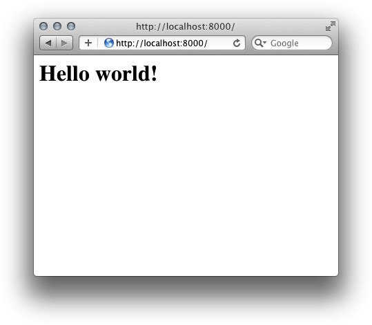
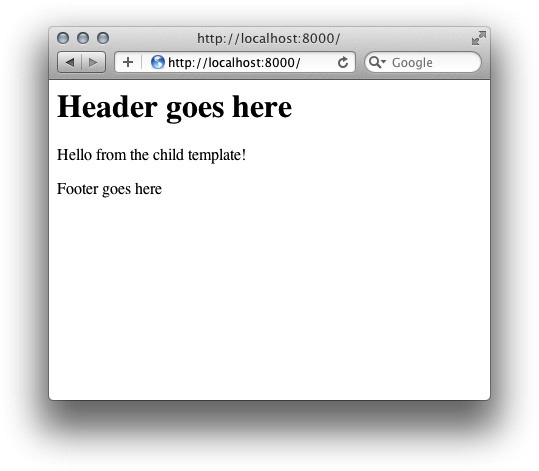
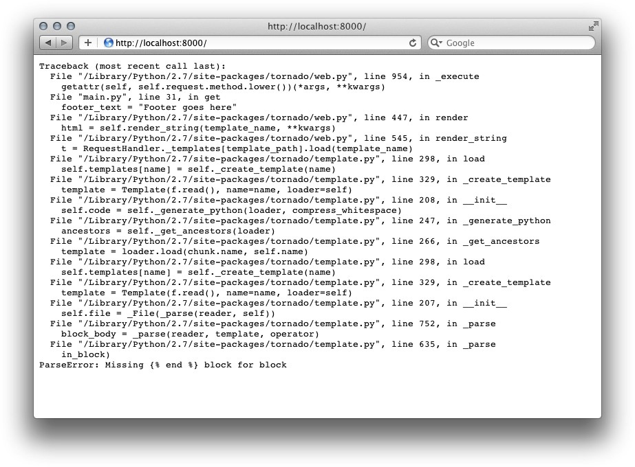
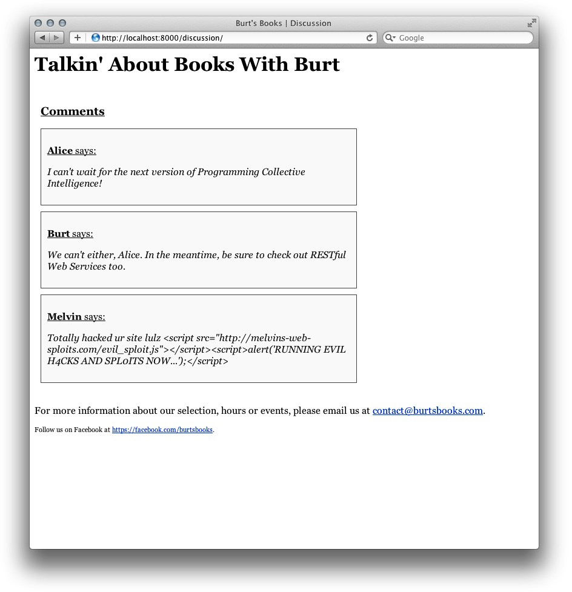
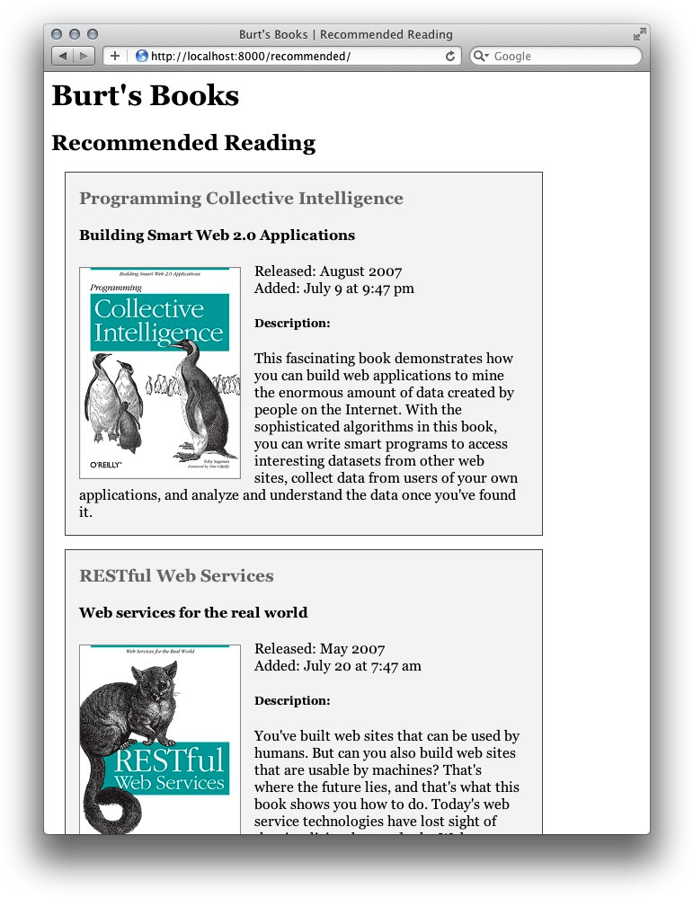
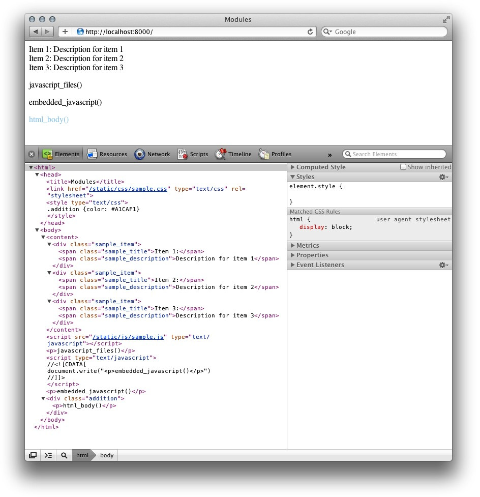

#第三章

**模板扩展**

**Extending Templates**

在第二章中，见识了如何使用Tornado模板系统，来轻易地将信息从请求处理器（handlers）传递给web页面，同时在方便地插入动态数据时，还能保持web标记的干净整洁。但是，大部分站点都会要利用到多用途内容，比如页面头部、底部及布局网格等（most site will want to make use of repurposable content like headers, footers, and layout grids）。本章中，就会研究如何通过拓展Tornado模板（by extending Tornado templates），或者说通过使用UI模块（UI modules），达到这个目的。

##HTML块及置换

**Blocks and Substitutions**

在费时费力地为web应用建立并设计好模板后，就会理所当然地想要尽可能多地在Python后端重用这些前端代码，对不对？还好！Tornado可以让你这样做。**通过其`extend`和`block`语句，Tornado支持模板继承**（template inheritance），此特性给予了制作流畅的、在适当时候具备多种用途的模板的掌控与灵活性（give you the control and flexibility to make fluid templates that can be repurposed as you see fit）。

要扩展某个现有模板，只需在新的模板文件顶部，放上``。比如使用下面的方式，就可以将一个父模板(a parent template, 这里是*main.html*)，扩展进入某个新的模板中。

``

这就会令到新的文件继承*main.html*中的所有标签，并接着改写那些需要改写的内容。有了此系统，就可以创建出一些主模板，转换进入其它为特殊需求的子页面，且同时有着可用的默认及动态文本和标签（With this system, you can create master templates, switch in other sub-pages for special needs, and have both default and dynamic text and markup ready to go）。


###块基础

**Basics of Blocks**

模板扩展令到重复使用先前编写的内容容易起来，但除非能**适用并修改这些先前的模板**，那也是没什么用的。**`block`语句**正是为解决这个问题。

**块语句将某个模板中的一些在扩展该模板时打算改变的元素封装起来**。比如，为运用上一个在每个页面中都可重写的动态头部，就可以将该头部放在父模板*main.html*中。


```html
    <head>
    
    </head>
```

接着，要从其子模板（the child template）*index.html*重写那个``部分，就只需要引用那个名字的块，并将想要的任何内容放入就可以了。

```python




    <h1>Hello, world!</h1>


任何继承了该模板的文件，都可以包含上其自己的``及``标签，来同样插入一些不同的内容。

而要从web应用调用这个子模板，只需像之前渲染其它模板一样，从Python脚本对其进行渲染即可。如下面这样。

```python
class MainHandler(tornado.web.RequestHandler):
    def get(self):
        self.render("index.html")
```

那么在这里，装入*index.html*时，来自*main.html*的`body`区块就会以消息“Hello world!”填充（见图3-1）。

好了，可以看看这项特性在处理整个页面结构时会多么有用，同时在多页面站点上多么节约时间。更棒的是，可为所有页面都用上多个的块，那么像是页面头部和底部这样的动态元素就可以包含在同一个流中（Better yet, you can make use of multiple blocks for each page, so dynamic elements like headers and footers can be included in the same flow）。

作为一个示例，将多个区块加入到父模板*main.html*中。

```html
<html>
    <body>
        <header>
            
        </header>
        <content>
            
        </content>
        <footer>
            
        </footer>
    </body>
</html>
```


*图3-1, Hello World!*

就可以从扩展该父模板*main.html*时，从子模板*index.html*引用这些区块。

```python


    <h1>{{ header_text }}</h1>


    <p>Hello from the child template!</p>


    <p>{{ footer_text }}</p>

```

Python脚本就像以前一样装入该子模板，除了在本例中会传入一些用在该模板中的字串变量（如图3-2所示）。

```python
class MainHandler(tornado.web.RequestHandler):
    def get(self):
        self.render(
            "index.html",
            header_text = "Header goes here",
            footer_text = "Footer goes here"
        )
```


*图3-2, 模板区块基础*

在**父模块的区块语句中，同样可以放入默认文本及标签**，在扩展模板（子模板）没有指定其自己版本的该区块时，这些默认文本和标签就会按原样渲染出来。如此而来，就可以根据页面的不同，而仅替换那些需要替换的内容，**这在要包含或替换脚本、CSS文件及标签块时，尤其有用**。



*图3-3, 模板区块报错*

> 如同在模板文档中指出的那样，”当前的报错功能......嘛，有意思哦。（error-reporting is currently...uh, interesting.）“ 语法错误或``语句未能闭合，会导致直接将`500: Internal Server Error`打印输出给浏览器(或是在`debug`模式下运行时完整的Python栈回溯，见图3-3)(A syntax mistake or failure to close `` statements can result in `500: Internal Server Error(or a full Python stack trace, if you are running in `debug` mode) being printed directly out to the browser`）。

###实践中的模板：博特的书籍

**Templates in Practice: Burt's Books**

那么听起来这两个特性很有意思，而又无法设想该在标准web应用中该怎么去用到它们？就让我们来看看这里的一个示例吧，在这里我们的朋友Burt运营了一家名为Burt's Books的书店。

Burt在他的店里买着很多书，而他的网站需要展示一些不同的内容，比如新到的书、店面信息等等。Burt想要站点有着一致的观感，同时又要能够容易地更新页面和页面区域。

要实现这点，Burt's Books就要有一个基于Tornado的网站，该网站使用带有所有样式、布局及页面头部/底部细节的主模板，然后采用轻量的子模板来处理各个页面。在部署了这个系统后，Burt就可以为新书发布、招聘信息、活动预告等等页面放在一起，这些页面共用一些同样的基本属性（To do this, Burt's Books has a Tornado-based website that uses a main template with all the style, layout, and header/footer details, and then used lightweight child templates to handle pages. With this system in place, Burt can put together pages for new release, employee recommendations, upcoming events, and more, all sharing common base attributes）。

Burt's Books网站使用了一个叫做`main.html`的主要基本模板，该模板包含了该站点的一般结构，像下面这样。

```html
<!DOCTYPE html>
<html>
    <head>
        <title>{{ page_title }}</title>
        <line rel="stylesheet" href="{{ static_url("css/style.css") }}" >
    </head>

    <body>
        <div id="container">
            <header>
                <h1>Burt's Books</h1>
            </header>
            <div id="main">
                <div id="content">
                    
                </div>
            </div>
            <footer>
                
        For more information about our selection, hours or events, 请发邮件给：
        <a href="mailto:contact@burtsbooks.com">contact@burtsbooks.com</a>
            </footer>
        </div>
        <script src="{{ static_url("js/script.js") }}"></script>
    </body>
</html>
```

这个页面定义了网站页面结构，应用了一个CSS样式表，并装入主要JavaScript文件。其它模板可对此进行扩展，并对必要的头部、页面主体及底部三个区块（blocks）进行替换。

站点首页（*index.html*）问候友好的网站访客，并提供有关书店的信息。通过扩展*main.html*，该文件只需包含替换了头部和页面主体区块的信息。

```html



    <h1>{{ header_text }}</h1>



    <div id="hello">
        <p>欢迎来到Burt's Books!</p>
        <p>......</p>
    </div>

```

这样做利用到该Tornado模板（*main.html*）页面底部区块默认行为, 并留下继承自父模板的联系信息。

而服务于站点，并将信息传递给首页模板（To serve the site and pass information to the index template），Burt's Books网站应运行下面的Python脚本(*main.py*)。

```python
#!/usr/bin/env python2.7
# -*-coding: utf-8-*-

import tornado.web
import tornado.httpserver
import tornado.ioloop
import tornado.options
import os.path

from tornado.options import define, options
define("port", default=8000, help="在指定端口上运行", type=int)


class Application(tornado.web.Application):
    def __init__(self):
        handlers = [
            (r"/", MainHandler)
        ]

        settings = dict(
            template_path=os.path.join(os.path.dirname(__file__), "templates"),
            static_path=os.path.join(os.path.dirname(__file__), "static"),
            debug=True,
        )
        tornado.web.Application.__init__(self, handlers, **settings)


class MainHandler(tornado.web.RequestHandler):
    def get(self):

        self.render(
            "index.html",
            page_title="Burt's Books | Home",
            header_text="欢迎来到Burt's Books!"
        )

if __name__ == "__main__":
    tornado.options.parse_command_line()
    http_server = tornado.httpserver.HTTPServer(Application())
    http_server.listen(options.port)
    tornado.ioloop.IOLoop.instance().start()
```

> 本例的结构与之前见到的有所不同，但没什么好害怕的。与其通过调用带有一个处理器列表和其他关键字参数(a list of handlers and other keyword arguments)的`tornado.web.Application`的构建器来创建出一个该类（`tornado.web.Application`）的实例（aka, object, 对象）, 我们直接定义了自己的应用程序子类，程序里就简单地称之为`Application`了。在我们定义的`__init__`方法中，我们创建了处理器列表及一个设置字典（the list of handlers and aa dictionary of settings）, 并将这些值像下面这样传递到初始化该子类的调用中。
> ```python
>   tornado.web.Application.__init__(self, handlers, **settings)
>```

那么在部署了本系统后，Burt's Books网站就可以很容易地对首页进行改变，同时保持基本模板（*main.html*）原封不懂地为其它页面所使用。此外，他们还可用上Tornado真正威力，将来自Python脚本及/或数据库的动态内容提供给访客。稍后就会对此进行探究。

###自动转换

**Autoescaping**

默认情况下，Tornado会自动*转换*模板中的内容，将那些标签转换成它们对应的HTML实体（By default, Tornado will automatically *escape* content in templates, turning tags into their associated HTML entities）。这样做保护了那些数据库驱动的网站（database-backed websites）免受恶意脚本的攻击。比如说站点有一个评论版块，用户在那里可将他们想要的任意文本作为讨论的一部分加入进去。尽管一些诸如标记和样式冲突（像是评论中未封闭的`<h1>`）的HTML标签不会造成明显的威胁，但一些未转换的`<script>`标签却可以令到攻击者载入外部JavaScript文件，为其开启跨站点脚本攻击漏洞之门（unscaped `<script>` tags can allow attacks to load external JavaScript files, openning up the door for cross-site scripting, or XSS, vulnerabilities）。

我们来看看Burt's Books站点上的一个用户反馈页面。Melvin, 今天感到相当恶意，就会利用评论表单提交如下的文本。

```html
Totally hacked your site lulz »
<script>alert('RUNN1NG 3V1L H4CK5 4ND 5PL01T5 N0W...')</script>
```

当在给不受信任用户构建页面，却没有对用户内容进行转换时，该脚本标签就会被浏览器作为一个HTML元素进行解释并执行，所以Alice就会看到如图3-4所示的告警窗口。还好啦，Tornado将会自动对两个双尖括号之间的表达式进行转换。对Melvin早前输入的文件的转换将令到HTML标签失去活性，并渲染出以下文本（Thankfully, Tornado will automatically escape the expressions rendered between double curly braces. Escaping the text Melvin entered earlier will inactivate HTML tags and render the following string）。

```html
Totally hacked your site lulz »
&lt;script&gt;alert('RUNNING EVIL H4CKS AND SPL01TS NOW...')&lt;/script&gt;
```

此时当Alice访问该站时，就不会有恶意脚本得以执行了，她会看到如图3-5所示的页面。

> Tornado 1.x中，模板没有被自动转换，所以上面讨论的保护需要显式地对未处理的用户输入调用`escape()`方法（requires explicitly calling `escape()` on unsanitized user input）。


*图3-4, Web exploit问题*




*图3-5, Web Exploit问题 -- 已解决*

所以这里可以看到自动转换是怎样保护访客免受恶意脚本攻击。但是，在通过模板及模块来动态地提供HTML时，自动转换也会令到毫无防备（However, it can also catch you off guard when serving HTML dynamically via templates and modules）。

比如，如Burt打算在他的底部通过使用一个模板变量来设置联络电邮链接，就不会得到期望的HTML链接。想想下面这段摘录的模板。

```

{{ mailLink }}
```

它在页面源码中会被渲染成下面这样。

```html
&lt;a href=&quot;mailto:contact@burtsbooks.com&quot;&gt;Contact Us&lt;/a&gt;
```

这就是自动转换在起作用，显然，这不会有助于人们联系上Burt。

为解决这个问题，可以关闭自动转换，这既可以通过将`autoescape=None`传递给应用构建器（the Application constructor）, 也可以像下面这样对各个页面改变其自动转换行为。

```

{{ maillink }}
```

这些`autoescape`代码块不需要结束标签标签，且可将其设置为`xhtml_escape`来开启自动转换（这是默认行为），或者像上面的`None`来关闭自动转换。

不过，理想情况是会想要让自动转换生效的，因为那可以继续保护网站。因此，对各个标签，就可以使用``令到其输出未经转换的内容。

``

在运用诸如Tornado的`linkify()`及`xsrf_form_html()`等会受到自动转换设置影响的函数功能时， 这点尤其重要，应牢记下来。那么在打算使用`linkify()`来将某个链接包含到上个示例的页面底部时（在那里自动转换是开启的），就要通过一个``块来完成。

```

    <p>
        有关优选书、工作时间或活动信息, 请发邮件给：
        <a href="mailto:contact@burtsbooks.com">contact@burtsbooks.com</a>
    </p>
    <p>
        在脸簿上关注我们：
        
    </p>

```
这么一来，就可以既可以利用上`linkify()`这个很好的简化方法，仍又得到自动转换的好处。

##UI模组

**UI Modules**

如同已经见识到的，模板系统轻量又强大。在实际运用中，要遵循软件工程格言，*不要重复你自己（Don't Repeat Yourself, DRY）*。而**为消除多余代码，就可以制作出模板模块的一些组成部分**（make sections of our templates modular）。比如，对于那些显示条目清单的页面，就可以为其定义一个生成每个条目标记的单独模块。有比如，一组共用某个通用导航结构的页面，就可以自某个共用模块生成内容。Tornado的UI模组在这些情况下就特别有用（Tornado's UI Modules are especially helpful in these situations）。

**UI模组是一些封装了标记、样式以及包含于某个模板中的行为的一些可重用部件**（UI Modules are reusable components that encapsulate markup, style, and behavior for inclusion in a templates）。UI模组所定义的那些页面元素，通常会在多个模板中进行重用， 会是在同一模板中反复地包含进去。这些模组本身是一些继承自Tornado的`UIModule`类的、定义了一个`render`方法的简单Python类。在某个模板通过``标签引用了一个模组时，Tornado的模板引擎就会调用该模组的`render`方法，该方法返回一个字串来替换该模板中的该模组标签。UI模组也可以在输出的页面中嵌入它们自己的JavaScript和CSS代码，或是指定另外要包含的JavaScript或CSS文件。为此，可在定义UI模组时，可重写父类`tornado.UIModule`的`embeded_javascript`、`embedded_css`、`javascript_files`及`css_files`等方法。

###模组基本用法

**Basic Module Usage**

为了在一些模板中对模组进行引用，就必须在应用程序设置中对其宣告。`ui_modules`参数需要一个用于将模组名称与输出该模组的类对应起来的字典(In order to reference a module in your templates, you must declare it in the application's settings. The `ui_modules` parameter expect a dictionary that maps module names to the classes that render them)。分析一下示例3-1。

*示例 3-1, 模组基础：hello_module.py*

```python
#!/usr/bin/env python2.7
# -*-coding: utf-8-*-

import tornado.web
import tornado.httpserver
import tornado.ioloop
import tornado.options
import os.path

from tornado.options import options, define
define("port", default=8000, help=u"在给定的端口上运行", type=int)


class HelloHandler(tornado.web.RequestHandler):
    def get(self):
        self.render('hello.html')


class HelloModule(tornado.web.UIModule):
    def render(self):
        return '<h1>你好，世界！</h1>'


if __name__ == "__main__":
    tornado.options.parse_command_line()
    app = tornado.web.Application(
        handlers=[(r'/', HelloHandler)],
        template_path=os.path.join(os.path.dirname(__file__), 'templates'),
        ui_modules={
            'Hello': HelloModule
        }
    )
    server = tornado.httpserver.HTTPServer(app)
    server.listen(options.port)
    tornado.ioloop.IOLoop.instance().start()
```

本例的`ui_modules`字典中只有一个项目，其关联着对定义好的`HelloModule`类的、名为`Hello`的模组引用。

此时，在`HelloHandler`被调用，且`hello.html`得以渲染时，就可以使用``模板标签，将定义在类`HelloModule`中的`render`方法所返回的字串，包含进页面中。

```html
<html>
    <head><title>UI模组示例</title></head>
    <body>
        
    </body>
</html>
```

此模板就会在模组标签本身的位置，插入调用`HelloModule`所返回的字串。下一小节将会展示如何**通过扩展UI模组，来渲染它们自己的模板并包含脚本和样式表**。

###深入模组

**Modules in Depth**

通常情况下，对于某个模组去引用一个模板文件，而不是在该模组内直接去建立输出字串，才是有用的。这些模组所引用模板的标记与之前我们所看到的模板是完全一样的。

**UI模组的一个常见应用，就是对数据库或API查询结果进行循环，从而输出所有单个条目数据的同样标记**。比如，Burt想要创建一个Burt's Books站点中的推荐读物页面组成部分，他就要建立一个叫做*recommended.html*模板，该模板有着下面所展示的代码。如同在前面看到的那样，将以标签``调用该模组。

```



<h2>推荐读物</h2>
    
        
    

```

Burt应创建一个名为*book.html*的、Book模组自己的模板，并将其放在*templates/modules*目录下。一个简单的book模板看起来像下面这个样子。

```html
<div>
    <h3 class="book_title">{{ book["title"] }}</h3>
     class="book_image" />
</div>
```

现在，在定义类`BookModule`时，就要**调用其继承自`UIModule`的`render_string`**方法了。该方法显式地将模板及该方法的关键字参数输出为一个字串，该字串就是返回给该类的调用者的值。

```python
class BookModule(tornado.web.UIModule):
    def render(self, book):
        return self.render_string('modules/book.html', book=book)
```

在完整示例中，我们将使用下面的模板，取代之前的简易*book.html*模板，来对每本推荐书的所有属性值进行格式化。

```html
<div class="book">
    <h3 class="book_title">{{ book["title"] }}</h3>
    
        <h4 class="book_subtitle">{{ book["subtitle"] }}</h4>
    
     class="book_image" />
    <div class="book_details">
        <div class="book_date_released">发布日期：{{ book["date_released"] }}</div>
        <div class="book_date_added">上架日期：
            {{ locale.format_date(book["date_added"], relative=False) }}
        </div>
        <h5>内容简介：</h5>
        <div class="book_body"></div>
    </div>
</div>
```

有了此种排列，对`books`参数的每一本书传递给模板*recommended.html*的书，都会调用到模组`BookModule`。而在每次一本新书调用到`Book`模组时，该模组（及其*book.html*模板）就可以引用该`book`参数的各条字典项，并将这些数据进行恰当地格式化（如图3-6所示）。

现在就可以像平时一样，定义一个`RecommendedHandler`，用于渲染某个模板。那个模板就可以在输出推荐书目清单时，对`Book`模组进行引用了。

```python
class RecommendedHandler(tornado.web.RequestHandler):
    def get(self):
        self.render(
            "recommended.html",
            page_title="Burt's Books | 推荐读物",
            header_text="推荐读物",
            books=[
                {
                    "title": "Programming Collective Intelligence",
                    "subtitle": "Building Smart Web 2.0 Applications",
                    "image": "/static/images/collective_intelligence.gif",
                    "author": "Toby Segaran",
                    "date_added": 1310248056,
                    "date_released": "August 2007",
                    "isbn": "978-0-596-52932-1",
                    "description":
                    '''
                    <p>This fascinating book demonstrates how you
                    can build web applications to mine the enormous amount of
                    data created by people on the Internet. With the
                    sophisticated algorithms in this book, you can write smart
                    programs to access interesting datasets from other web
                    sites, collect data from users of your own
                    applications, and analyze and understand the data once
                    you've found it.</p>
                    '''
                }
            ]
        )
```

要用上另外的模组, 只需简单地将字典映射加入到`Application`构建器的`ui_modules`。因为网站模板可以对定义在`ui_modules`映射中的任意模组进行调用，就可以将特定功能以其专属模组予以实现（Because templates can refer to any module defined in the `ui_modules` mapping, it's easy to break out specific functionality into its own module）。



*图3-6, 具有了样式数据的Book模组*

> 在这个例子中，你可能已注意到`locale.format_date()`的使用。这调用了由`tornado.locale`模块所提供的日期处理方法，该模块本身就有着一些国际化相关的方法（which in itself has a collection of internationalization methods）。而`format_date()`选项默认对形如`xx time ago`这样的GMT Unix时间戳进行格式化，而可被这样使用。
> `{{ locale.format_date(book["date"]) }}`
> 该方法的`relative=False`参数令到其返回一个绝对时间（有小时和分钟），然而参数`full_format=True`就会令到其显示一个有着年月日及时间的完整日期（比如，July 9, 2011 at 9:47pm），这又可以与`shorter=True`配合使用来隐藏掉时间，而只显示年月日。

**模块`tornado.locale`在处理时间和日期时，以及字串本地化处理的其它支持上，有着巨大的帮助。**

###嵌入JavaScript及CSS

**Embedding JavaScript and CSS**

为与这些模组一起能提供更多的灵活性，Tornado允许经由`embedded_css()`和`embedded_javascript()`方法，嵌入单独CSS及JavaScript。比如，在调用到模组`BookModule`时想要将一行文本添加到DOM时，就可以在该模组中嵌入JavaScript来实现。

```python
class BookModule(tornado.web.UIModule):
    def render(self, book):
        return self.render_string('modules/book.html', book=book)

    def embedded_javascript(self):
        return "document.write(\"hi!\")"
```

当调用到该模组时，该模组就要将`document.write(\"hi!\")`用一个`<script>`标签包围起来，并将其插入到紧接着`<body>`闭合标签之前。

```html
<script type="text/javascript">
//<![CDATA[
document.write("hi!")
//]]>
</script>
```

显然，只是写一下文档主体（the document body）并没有什么卵用，但有了这么一个可将那些在所有模组中包含进去的脚本包含进来的选项，就赋予创建这些模组时巨大灵活性。

类似地，可将额外的、只会在调用到这些模组时才会装入的CSS规则，放入到模组定义中。

```python
    def embedded_css(self):
        return ".book {background-color: #F5F5F5}"
```

本例中，CSS规则`.book {background-color: #F5F5F5}`会被一个`<style>`标签包围起来，并插入到紧接着`<head>`闭合标签之前。

```html
<style type="text/css">
.book {background-color: #F5F5F5}
</style>
```

为获得更多的灵活性，就可以简单地利用`html_body()`, 同样将完整的HTML标记插入到`</body>`闭合标签之前。

```python
    def html_body(self):
        return "<script>document.write(\"你好\")</script>"
```

显然，尽管能加入一些行内脚本及样式是有用的，但如有一些将样式表及脚本文件包含进来的更严肃的包含方式的话（同时代码更为整洁），就更加美好了。而这种将样式表及脚本文件包含进来的方法，也是以同样的方式工作的，那么就可以使用`javascript_files()`及`css_files()`来包含一些完整的文件，同时既可以是保存在本地，也可以是外部保存的。

比如，可以像这样将一个单独的本地CSS文件包含进来。

```python
    def css_files(self):
        return "/static/css/newreleases.css"
```

或者像下面这样来获取到一个外部JavaScript文件。

```python
    def javascript_files(self):
        return "https://ajax.googleapis.com/ajax/libs/jqueryui/1.8.14/jquery-ui.min.js"
```

这在某个模组需要额外的一些库，而这些库在应用中其它地方又不是必要的是，是特别有用的。比如，有一个要用到jQuery UI库（其在应用中其它地方没有用到）的模组，就只需为此样例模组装入文件*jquery-ui.min.js*, 从而对那些无需该库的页面省下载入该文件的时间。

> 因为模组的JavaScript嵌入和HTML嵌入功能都将`</body>`末端作为目的地，所以由`html_body()`、`javascript_files()`及`embedded_javascript()`输出的内容都会插入到页面底部，同时这些内容将会以与指明它们的顺序相反的顺序出现。
>
> 如有下面这样的模组。
>
> ```python
> class SampleModule(tornado.web.UIModule):
>    def render(self, sample):
>    return self.render_string(
>        "modules/sample.html",
>        sample=sample
>    )
>    def html_body(self):
>        return "<div class=\"addition\"><p>html_body()</p></div>"
>    def embedded_javascript(self):
>        return "document.write(\"<p>embedded_javascript()</p>\")"
>    def embedded_css(self):
>        return ".addition {color: #A1CAF1}"
>    def css_files(self):
>        return "/static/css/sample.css"
>    def javascript_files(self):
>        return "/static/js/sample.js"
> ```

> 那么首先写出的是`html_body()`字串，作为`</body>`标签之前的最后一个元素。接着输出的是`embedded_javascript()`, 最后是`javascript_files()`。在图3-7中，将看到这是如何运行的。
>
> 注意这里并没有包含那些依赖其它插入内容的方法（比如一些依赖与其它文件的JavaScript函数），因为它们输出的顺序会于期望的有所不同。

##小结

**Summing Up**

如同所看到的，Tornado令到**扩展模板**容易起来，因此web代码就可以在整个站点中容易地得到重用。同时因为有了**模组的加持**，就可以在那些文件、样式及脚本动作需要包含进来方面做出更为精致的决定。不过，尽管上面的例子依赖于Python的原生数据类型的一起运行，这样还算容易，但**在实践中要将大的数据结构硬编码到应用中几乎是不可能的**。下一章，我们就会看到，如何与持久存储结合起来，以处理有关数据存储、提供以及动态内容编辑等问题。



*图3-7, 装入的模组样式及脚本*

