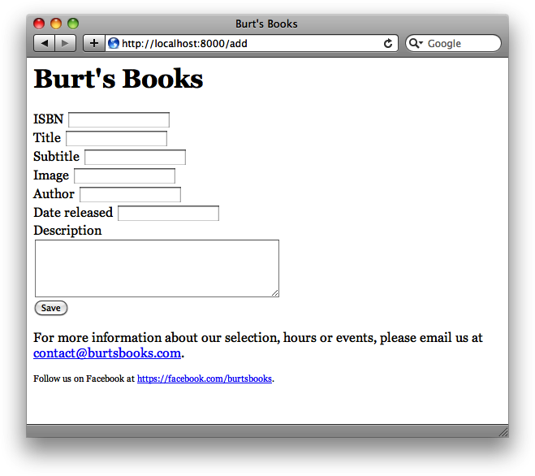

#第四章

**数据库**

**Database**

本章中，将会展示一些用到数据库的Tornado web应用新例子。将以一个简单的RESTful API示例开始，然后继续来创建一个在之前的“模板实践：Burt‘s Books”中引入的Burt's Books网站的完整功能版本。

本章中的示例使用了MongoDB作为数据库，以及pymongo作为接连到MongoDB的Python驱动器。当然，有众多数据库都可以以用在Tornado web应用中，比如Redis、CouchDB及MySQL等几个都是相当著名的选项，同时Tornado本身就带有一个包装MySQL请求的库（Tornado itself ships with a library for wrapping MySQL requests）。选择使用MongoDB是因为其简单性及方便性：安装容易又与Python代码集成很好。其无模式本性令到不必为其预先定义数据结构, 而这对原型设计是极好的（Its schemaless nature makes it unnecessary to predefine your data structures, which is great for prototyping）。

本章中假定在运行示例代码的机器上有一个MongoDB的安装运行着，但将代码修改为使用远端服务器上运行的MongoDB是很容易的。如不想在自己的机器上安装MongoDB, 或者所用系统上没有MongoDB的二进制程序，那么网络上有着一些托管的MongoDB服务（a number of hosted MongoDB services）可以用于替代使用。建议使用[MongoHQ](http://www.mongohq.com/)。在前几个示例中，将假设在本地机器上有MongoDB运行，不过也是很容易将代码修改为运行于远端服务器的（包括MongoHQ）。

同时假定你有一些数据库方面的经验，但并不一定是特定于MongoDB的任何经验。当然，这里只能涉及到MongoDB皮毛的一些东西；一定要读读MongoDB文档([http://www.mongodb.org/display/DOCS/Home](http://www.mongodb.org/display/DOCS/Home)), 获取更多信息。那么就开始吧！

> **译者注：**由于机器上没有MongoDB, 译者对数据库的选用上，对于小数据量，倾向于使用SQLite这样的轻量基于磁盘的数据库C库，其无需单独服务器进程。**SQLite使用非标准的SQL查询语言变体。用于内部数据存储**。在构建应用原型时用SQLite, 然后将代码移植到PostgreSQL这样的更大数据库上。


##使用sqlite3模块对SQLite的基本操作

**Basic SQLite Operations with sqlite3**

在可以写出一个使用SQLite web应用之前，需要学习如何从Python用到SQLite。本小节将学到如何使用sqlite3模块，连接到SQLite数据库，接着就是使用sqlite3来创建、获取及更新一个SQLite数据库中的数据了。

sqlite3模块是由Gerhard Haring编写的，提供了一个符合[PEP 249](http://www.python.org/dev/peps/pep-0249)中描述的DB-API 2.0规范的SQL接口。

###建立一个连接

**Establishing a Connection**

首先，需要导入sqlite3库，并建立一个到某SQLite数据库的连接。

```python
>>> import sqlite3
>>> conn = sqlite3.connect('example.db')
```

一旦有了一个连接，就可以创建一个焦点对象（a Cursor object），而通过调用焦点对象的`execute()`方法，就可以执行SQL命令了。

```python
>>> import sqlite3
>>> conn = sqlite3.connect('example.db')
>>> c = conn.cursor()
>>> sqlstr = '''DROP TABLE IF EXISTS stocks'''
>>> c.execute(sqlstr)
<sqlite3.Cursor object at 0x7fb5b01230a0>
>>> sqlstr = '''CREATE TABLE stocks (date text, trans text, symbol text, qty real, price real)'''
>>> c.execute(sqlstr)
<sqlite3.Cursor object at 0x7fb5b01230a0>
>>> sqlstr = "INSERT INTO stocks VALUES ('2006-01-05', 'BUY', 'RHAT', 100, 35.14)"
>>> c.execute(sqlstr)
<sqlite3.Cursor object at 0x7fb5b01230a0>
>>> conn.commit()
>>> symbol = 'RHAT'
>>> sqlstr = "SELECT * FROM stocks WHERE symbol = '%s'" % symbol
>>> c.execute(sqlstr)
<sqlite3.Cursor object at 0x7fb5b01230a0>
>>> print c.fetchone()
(u'2006-01-05', u'BUY', u'RHAT', 100.0, 35.14)
>>> t = ('RHAT', )
>>> sqlstr = "SELECT * FROM stocks WHERE symbol = ?"
>>> c.execute(sqlstr, t)
<sqlite3.Cursor object at 0x7fb5b01230a0>
>>> print c.fetchone()
(u'2006-01-05', u'BUY', u'RHAT', 100.0, 35.14)
>>> purchases = [('2006-03-28', 'BUY', 'IBM', 1000, 45.00),]
>>> purchases.append(('2006-04-05', 'BUY', 'MSFT', 1000, 72.00))
>>> purchases.append(('2006-04-06', 'SELL', 'IBM', 500, 53.00))
>>> sqlstr = "INSERT INTO stocks VALUES (?, ?, ?, ?, ?)"
>>> c.executemany(sqlstr, purchases)
<sqlite3.Cursor object at 0x7fb5b01230a0>
>>> conn.commit()
>>> sqlstr = "SELECT * FROM stocks ORDER BY price"
>>> for row in c.execute(sqlstr):
...     print row
...
(u'2006-01-05', u'BUY', u'RHAT', 100.0, 35.14)
(u'2006-03-28', u'BUY', u'IBM', 1000.0, 45.0)
(u'2006-04-06', u'SELL', u'IBM', 500.0, 53.0)
(u'2006-04-05', u'BUY', u'MSFT', 1000.0, 72.0)
>>>
```

###SQLite表记录与JSON

**SQLite Table Records and JSON**

在开发web应用时，经常要将一个Python字典变量序列化为一个JSON对象（比如，作为对一次AJAX请求的响应）。而使用sqlite3从SQLite中取得的记录是简单的元组（tuple），在将其转换成字典后，就假定可以通过将其传递给`json`模块的`dumps`函数，而简单地转换成JSON对象。

```python
>>> import sqlite3
>>> import json
>>> conn = sqlite3.connect('example.db')
>>> cur = conn.cursor()
>>> sqlstr = "SELECT * FROM stocks ORDER BY price"
>>> names = ('date', 'trans', 'symbol', 'qty', 'price')
>>> results = list()
>>> for row in cur.execute(sqlstr):
...     result = dict()
...     for i  in range(5):
...         result[names[i]] = row[i]
...
...     results.append(result)
...
>>> for res in results:
...     json.dumps(res)
...
'{"date": "2006-01-05", "symbol": "RHAT", "trans": "BUY", "price": 35.14, "qty": 100.0}'
'{"date": "2006-03-28", "symbol": "IBM", "trans": "BUY", "price": 45.0, "qty": 1000.0}'
'{"date": "2006-04-06", "symbol": "IBM", "trans": "SELL", "price": 53.0, "qty": 500.0}'
'{"date": "2006-04-05", "symbol": "MSFT", "trans": "BUY", "price": 72.0, "qty": 1000.0}'
```

##一个简单的持久化web服务

**A Simple Persistent Web Service**

现在我们已经掌握了编写一个访问SQLite数据库中数据的足够知识。首先，将要写出一个仅从SQLite中读取数据的web服务。接着要写一个读和写数据的。

###一个只读词典应用

**A Read-Only Dictionary**

将要构建的这个应用是一个简单的基于web的字典。只能发出每个特定单词的请求，然后回来的是那个单词的定义。下面就是一个典型的交互看起来的样子。

```bash
$ curl http://localhost:8000/oarlock
{definition: "A device attached to a rowboat to hold the oars in place", "word": "oarlock"}
```

此web服务将从一个SQLite数据库中拉取数据。肯定的是，将会通过数据表的`word`字段来查找记录。在实际研究该web应用的源码前，先通过Python交互式解释器将一些单词加入到数据库中吧。

```python
>>>import sqlite3
>>>conn = sqlite3.connect('example.db')
>>>cur = conn.cursor()
>>>sqlstr = "DROP TABLE IF EXISTS dict"
>>>cur.execute(sqlstr)
>>>sqlstr = "CREATE TABLE dict (word text, definition text)"
>>>cur.execute(sqlstr)
>>>words = [('oarlock', 'A device attatched to a rowboat to hold the oars in place'),]
>>>words.append(('seminomadic', 'Only partially nomadic'))
>>>words.append(('perturb', 'Bother, unsettle, modify'))
>>>sqlstr = "INSERT INTO dict VALUES (?, ?)"
>>>cur.executemany(sqlstr, words)
```

示例4-1中是词典web服务的源码，该程式将对上面加入的单词进行查找，并以单词定义响应查询请求。

*例4-1, 词典web服务：definition_readonly.py*

```python
#!/usr/bin/env python2.7
# -*-coding: utf-8**

import tornado.httpserver
import tornado.ioloop
import tornado.options
import tornado.web
import os.path

import sqlite3

from tornado.options import define, options
define("port", default=8000, help=u"在给定的端口上运行", type=int)

BASE_DIR = os.path.dirname(os.path.abspath(__file__))


def _dict_factory(cursor, row):
    '''将sqlite 数据库连接的row_factory方法由默认，重写为此方法'''
    d = dict()
    for idx, col in enumerate(cursor.description):
        d[col[0]] = row[idx]
    return d


def _execute(query):
    '''用于执行到一个本地sqlite数据库的查询'''
    dbPath = os.path.join(BASE_DIR, 'example.db')
    conn = sqlite3.connect(dbPath)
#  用上面定义的_dict_factory重写conn.row_factory
    conn.row_factory = _dict_factory
    cursorobj = conn.cursor()
    try:
        cursorobj.execute(query)
        result = cursorobj.fetchall()
        conn.commit()
    except:
        raise
    conn.close()
    return result


class Application(tornado.web.Application):
    def __init__(self):
        handlers = [(r"/(\w+)", WordHandler)]
        tornado.web.Application.__init__(self, handlers, debug=True)


class WordHandler(tornado.web.RequestHandler):
    def get(self, word):
        sql = "SELECT definition FROM dict WHERE word = '%s'" % word
        res = _execute(sql)
        if res:
            self.write(res[0])
        else:
            self.set_status(404)
            self.write({"error": "word not found"})
        # self.application.conn.close()

if __name__ == "__main__":
    tornado.options.parse_command_line()
    http_server = tornado.httpserver.HTTPServer(Application())
    http_server.listen(options.port)
    tornado.ioloop.IOLoop.instance().start()
```

在命令行上像下面这样运行此程式。

```bash
$ python definitions_readonly.py
```

现在使用`curl`或web浏览器来向该应用发出一个请求。

```bash
$ curl http://localhost:8000/perturb
{"definition": "Bother, unsettle, modify", "word": "perturb"}
```

假如请求了一个未曾加入到数据库的单词，就会得到一个404响应，以及一个错误消息。

```bash
$ curl http://localhost:8000/snorkle
{"error": "word not found"}
```

那么这个程式是怎么工作的呢？ 我们来讨论一下代码中的一些关键行。一开始，在程式顶部通过`import sqlite3`将Python模块`sqlite3`装入进来。接着编写了全局函数`_dict_factory`和`_execute`, 这两个全局函数封装了SQLite数据库查询，并返回字典清单的查询结果，实现一定程度的无模式化，便于和JSON对接。

```python
def _dict_factory(cursor, row):
    '''将sqlite 数据库连接的row_factory方法由默认，重写为此方法'''
    d = dict()
    for idx, col in enumerate(cursor.description):
        d[col[0]] = row[idx]
    return d


def _execute(query):
    '''用于执行到一个本地sqlite数据库的查询'''
    dbPath = os.path.join(BASE_DIR, 'example.db')
    conn = sqlite3.connect(dbPath)
#  用上面定义的_dict_factory重写conn.row_factory
    conn.row_factory = _dict_factory
    cursorobj = conn.cursor()
    try:
        cursorobj.execute(query)
        result = cursorobj.fetchall()
        conn.commit()
    except:
        raise
    conn.close()
    return result
```

一旦有了`_execute`这个全局函数，就可以在程式的任意地方执行SQL查询了。下面是`WordHandler`类的`get`方法。

```python
    def get(self, word):
        sql = "SELECT definition FROM dict WHERE word = '%s'" % word
        ret = dict()
        ret['word'] = word
        res = _execute(sql)
        if res:
            ret['definition'] = res[0][0]
            self.write(ret)
        else:
            self.set_status(404)
            self.write({"error": "word not found"})
```

###往词典中写入记录

**Writing the Dictionary**

在词典中查找单词是很好玩的，但之前必须要通过交互式Python解释器加入单词却始终是个困扰。示例中的下一步，就要让经由给该web服务发起HTTP请求给的方式，来创建或是修改单词记录成为可能。

它将这样工作，对某个特定单词发出的`POST`请求，将用请求主体所给出的定义来对既有定义进行修改。而如果该特定单词尚不存在，就创建该单词的记录。比如，要创建一个新单词，就像下面这样操作。

```bash
$ curl -d definition=a+leg+shirt http://localhost:8000/pants
{"definition": "a leg shirt", "word": "pants"}
```

这样就创建出了该单词，就可以通过一个`GET`请求，请求到这个单词。

```bash
$ curl http://localhost:8000/pants
{"definition": "a leg shirt", "word": "pants"}
```

通过执行一个带有某个单词的定义字段的`POST`请求，可以对某个既有单词进行修改（与创建一个新的单词所用的参数相同）。

```bash
$ curl -d definition=a+boat+wizard http://localhost:8000/oarlock
{"definition": "a boat wizard", "word": "oarlock"}
```

示例4-2是读/写版本的词典web服务源码。

*例4-2, 一个可读/写的词典服务：definitions_readwrite.py*

```python
#!/usr/bin/env python2.7
# -*-coding: utf-8**

import tornado.httpserver
import tornado.ioloop
import tornado.options
import tornado.web
import os.path

import sqlite3

from tornado.options import define, options
define("port", default=8000, help=u"在给定的端口上运行", type=int)

BASE_DIR = os.path.dirname(os.path.abspath(__file__))


def _dict_factory(cursor, row):
    '''将sqlite 数据库连接的row_factory方法由默认，重写为此方法'''
    d = dict()
    for idx, col in enumerate(cursor.description):
        d[col[0]] = row[idx]
    return d


def _execute(query):
    '''用于执行到一个本地sqlite数据库的查询'''
    dbPath = os.path.join(BASE_DIR, 'example.db')
    conn = sqlite3.connect(dbPath)
#  用上面定义的_dict_factory重写conn.row_factory
    conn.row_factory = _dict_factory
    cursorobj = conn.cursor()
    try:
        cursorobj.execute(query)
        result = cursorobj.fetchall()
        conn.commit()
    except:
        raise
    conn.close()
    return result


class Application(tornado.web.Application):
    def __init__(self):
        handlers = [(r"/(\w+)", WordHandler)]
        tornado.web.Application.__init__(self, handlers, debug=True)


class WordHandler(tornado.web.RequestHandler):
    def get(self, word):
        sql = "SELECT definition FROM dict WHERE word = '%s'" % word
        res = _execute(sql)
        if res:
            self.write(res[0])
        else:
            self.set_status(404)
            self.write({"error": "word not found"})

    def post(self, word):
        definition = self.get_argument("definition")
        sql = "SELECT definition FROM dict WHERE word = '%s'" % word
        output = dict()
        output["word"] = word
        output["definition"] = definition
        res = _execute(sql)
        if res:
            sql = "UPDATE dict SET definition = '%s' WHERE word = \
                    '%s'" % (definition, word)
            _execute(sql)
        else:
            sql = "INSERT INTO dict VALUES ('%s', '%s')" % (word, definition)
            _execute(sql)
        self.write(output)

if __name__ == "__main__":
    tornado.options.parse_command_line()
    http_server = tornado.httpserver.HTTPServer(Application())
    http_server.listen(options.port)
    tornado.ioloop.IOLoop.instance().start()
```

除了`WordHandler`中增加的`post`方法，该源码与只读服务完全一样。来细细地研究一下这个方法。

```python
    def post(self, word):
        definition = self.get_argument("definition")
        sql = "SELECT definition FROM dict WHERE word = '%s'" % word
        output = dict()
        output["word"] = word
        output["definition"] = definition
        res = _execute(sql)
        if res:
            sql = "UPDATE dict SET definition = '%s' WHERE word = \
                    '%s'" % (definition, word)
            _execute(sql)
        else:
            sql = "INSERT INTO dict VALUES ('%s', '%s')" % (word, definition)
            _execute(sql)
        self.write(output)
```

完成的第一件事就是使用`ReqestHandler`类的`get_argument`方法来取得自`POST`请求传入的`definition`参数。接着，如同在`get`方法中一样，调用全局函数`_execute`尝试从数据库查找请求路径中那个单词。如找到该单词，就将该单词对应记录的`definition`字段更新为从`POST`参数得到的字串。有没有找到该单词，就又通过全局函数`_execute`在数据库中创建一条新的记录。在两种情况下，都会将一个字典写入到对请求的响应中。

##Burt的书店

**Burt's Books**

第3章中，展示了一个用于说明如何使用Tornado模板工具来构建复杂web应用的实例 -- Burt's Books应用。在本节中, 将展示一个使用SQLite作为数据存储的Burt's Books示例。（在继续之前，可以回顾一下第3章中的Burt's Books实例）

###读出书本数据（从数据库）

**Reading Books(From the Database)**

我们从一些简单的开始：一个版本的Burt's Books是从数据库中读取到书刊清单的。那么首先就要在SQLite中创建一个数据库及数据表，并添加进一些书本记录，像下面这样。

```python
>>> import sqlite3
>>> conn = sqlite3.connect('example.db')
>>> cur = conn.cursor()
>>> sql = "DROP TABLE IF EXISTS books"
>>> cur.execute(sql)
<sqlite3.Cursor object at 0x7f949c5a70a0>
>>> sql = "CREATE TABLE books (title text, subtitle text, image text, author text, date_added real, date_released text, isbn text, description text)"
>>> cur.execute(sql)
<sqlite3.Cursor object at 0x7f949c5a70a0>
>>> sql = "INSERT INTO books VALUES (?, ?, ?, ?, ?, ?, ?, ?)"
>>> books = [("Programming Collective Intelligence", "Building Smart Web 2.0 Applications", "/static/images/collective_intelligence.gif", "Toby Segaran", 1310248056, "August 2007", "978-0-596-52932-1", "<p>[...]</p>"), ]
>>> books.append(("RESTful Web Services", "Web services for the real world", "/static/images/restful_web_services.gif", "Leonard Richardson, Sam Ruby", 1311148056, "May 2007", "978-0-596-52926-0", "<p>[...]</p>"))
>>> cur.executemany(sql, books)
<sqlite3.Cursor object at 0x7f949c5a70a0>
>>> conn.commit()
>>> conn.close()
```

(为节省空间，省略了这些书的简介)一旦在数据库中有了这些记录，就可以开工了。示例4-3展示了修改版的Burt's Books web应用，名为*burts_books_db.py*。

*例4-3, 从数据库读取书本清单：burts_books_db.py*

```python
#!/usr/bin/env python2.7
# -*-coding: utf-8-*-

import tornado.web
import tornado.httpserver
import tornado.ioloop
import tornado.options
import os.path
import tornado.auth
import tornado.escape
from tornado.options import define, options
import sqlite3


BASE_DIR = os.path.dirname(os.path.abspath(__file__))

define("port", default=8000, help="在指定端口上运行", type=int)


def _dict_factory(cursor, row):
    '''将sqlite 数据库连接的row_factory方法由默认，重写为此方法'''
    d = dict()
    for idx, col in enumerate(cursor.description):
        d[col[0]] = row[idx]
    return d


def _execute(query):
    '''用于执行到一个本地sqlite数据库的查询'''
    dbPath = os.path.join(BASE_DIR, 'example.db')
    conn = sqlite3.connect(dbPath)
#  用上面定义的_dict_factory重写conn.row_factory
    conn.row_factory = _dict_factory
    cursorobj = conn.cursor()
    try:
        cursorobj.execute(query)
        result = cursorobj.fetchall()
        conn.commit()
    except:
        raise
    conn.close()
    return result


class BookModule(tornado.web.UIModule):
    def render(self, book):
        return self.render_string('modules/book.html', book=book)

    def embedded_javascript(self):
        return "document.write(\"hi!\")"

    def css_files(self):
        return "/static/css/newreleases.css"

    def javascript_files(self):
        return "https://ajax.googleapis.com/ajax/libs/jqueryui/\
                1.8.14/jquery-ui.min.js"


class Application(tornado.web.Application):
    def __init__(self):
        handlers = [
            (r"/", MainHandler),
            (r"/recommended/", RecommendedHandler)
        ]

        settings = dict(
            template_path=os.path.join(os.path.dirname(__file__), "templates"),
            static_path=os.path.join(os.path.dirname(__file__), "static"),
            ui_modules={
                'Book': BookModule,
            },
            debug=True,
        )
        tornado.web.Application.__init__(self, handlers, **settings)


class MainHandler(tornado.web.RequestHandler):
    def get(self):
        self.render(
            "index.html",
            page_title="Burt's Books | Home",
            header_text="欢迎来到Burt's Books!"
        )


class RecommendedHandler(tornado.web.RequestHandler):
    def get(self):
        sql = "SELECT * FROM books WHERE 1"
        books = _execute(sql)
        self.render(
            "recommended.html",
            page_title="Burt's Books | 推荐读物",
            header_text="推荐读物",
            books=books
        )

if __name__ == "__main__":
    tornado.options.parse_command_line()
    http_server = tornado.httpserver.HTTPServer(Application())
    http_server.listen(options.port)
    tornado.ioloop.IOLoop.instance().start()
```

可以看到，此程式与第3章中最初的Burt's Books web应用基本完全相同。其中有几个不同点。首先，加入了`_execute`这个全局函数。和本章前面示例中的一样，对`sqlite3`模块的`Connection`对象的`raw_factory`方法进行了重写，重写为全局函数`_dict_factory`。


```python
def _dict_factory(cursor, row):
    '''将sqlite 数据库连接的row_factory方法由默认，重写为此方法'''
    d = dict()
    for idx, col in enumerate(cursor.description):
        d[col[0]] = row[idx]
    return d


def _execute(query):
    '''用于执行到一个本地sqlite数据库的查询'''
    dbPath = os.path.join(BASE_DIR, 'example.db')
    conn = sqlite3.connect(dbPath)
#  用上面定义的_dict_factory重写conn.row_factory
    conn.row_factory = _dict_factory
    cursorobj = conn.cursor()
    try:
        cursorobj.execute(query)
        result = cursorobj.fetchall()
        conn.commit()
    except:
        raise
    conn.close()
    return result
```

其次，构造了SQL查询语句，并调用全局函数`_execute`执行该SQL语句，来从SQLite数据库中获取到一个书本清单(list)，并在`RecommendedHandler`请求处理器的`get`方法中渲染*recommended.html*时，将该清单传入该模板。

```python
    def get(self):
        sql = "SELECT * FROM books WHERE 1"
        books = _execute(sql)
        self.render(
            "recommended.html",
            page_title="Burt's Books | 推荐读物",
            header_text="推荐读物",
            books=books
        )
```

第3章中示例的书本清单是硬编码到`get`方法中的。但因为前面我们加入到SQLite数据库中的书本记录（record）与第三章硬编码的书本字典（dictionaries）数据有着同样的字段，所以第3章中编写的那些模板不加改动就可使用。

像下面这样运行此程式。

```bash
$ python burts_books_db.py
```

然后将web浏览器指向*http://localhost:8000/recommended/*(注意最后的反斜杠)。到这里，就跟硬编码版的Burt's Books看起来完全一样了（见图3-6）。

###编辑和加入书籍

**Editing and Adding Books**

下一步就是要为数据库中已有图书的编辑，以及将新书加入到数据库而制作一个界面了。为了达到这个目的，就需要制作出**供用户填入书籍信息的表单**，一个**用于提供该表单的请求处理器**，以及一个**处理表单提交结果并将其放入数据库的请求处理器**。

Burt's Books的这个版本的源码，与先前所给出的将近一致，其有着下面讨论的一些补充。你可以跟随本书附带的完整源码；相关的程式为*burts_books_rwdb.py*。

####编辑表单的输出

以下是`BookEditHandler`请求处理器类的源码，该处理器完成两个任务。

    1. 到处理器的一个`GET`请求，输出一个HTML表单（该表单位于模板*book_edit.html*中）， 有可能有来自某一已有书本的数据。
    2. 到处理器的一个`POST`请求，取得来自表单的数据，然后要么更新数据库中的某一现有书本，要么在数据库中加入一本新书，取决于所提供的数据。

下面就是该请求处理器的源码。

```python
class BookEditHandler(tornado.web.RequestHandler):
    def get(self, isbn=None):
        book = dict()
        if isbn:
            sql = "SELECT * FROM books WHERE isbn = '%s'" % isbn
            book = _execute(sql, '')[0]
        self.render(
            "book_edit.html",
            page_title="Burt's Books",
            header_text="编辑书籍",
            book=book
        )

    def post(self, isbn=None):
        import time
        book_fields = ['isbn', 'title', 'subtitle', 'image',
            'author', 'date_released', 'description']
        book = dict()
        if isbn:
            sql = "SELECT * FROM books WHERE isbn = '%s'" % isbn
            book = _execute(sql, '')[0]
        for key in book_fields:
            book[key] = self.get_argument(key, None)

        if isbn:
            sql = '''UPDATE books SET isbn = "%s", title = "%s", \
                    subtitle = "%s", image = "%s", author = "%s", \
                    date_released = "%s", description = "%s" WHERE \
                    isbn = ?''' % tuple(book[k] for k in book_fields)
            _execute(sql, isbn)
        else:
            book['date_added'] = int(time.time())
            book_fields.append('date_added')
            sql = "INSERT INTO books (isbn, title, subtitle, image, \
                author, date_released, description, date_added) \
                VALUES ('%s', '%s', '%s', '%s', '%s', '%s', '%s', '%s')" \
                % tuple(book[k] for k in book_fields)
            _execute(sql, '')
        self.redirect("/recommended/")
```

稍后会详细谈及，不过先要讨论一下怎样设置`Application`类来将访问请求路由到此处理器。下面是`Application`类的`__init__`方法中有关的部分。

```python
        handlers = [
            (r"/", MainHandler),
            (r"/recommended/", RecommendedHandler)
            (r"/edit/([0-9Xx\-]+)", BookEditHandler),
            (r"/add", BookEditHandler)
        ]
```

可以看出，`BookEditHandler`处理来自两个*不同*路径模式匹配的请求。其中一个是`/add`, 提供不带现有信息的编辑表单，如此就可以往数据库加入一本新书；而另一个则是`/edit/([0-9Xx\-]+)`, 输出带有一本已存在图书的信息的表单，依据的是书的ISBN。

####从数据库取得书籍信息

**Retrieving book information from the database**

在开始进一步分析`BookEditHandler`请求处理器类时，先要看看对全局函数`_execute`做出的改变。

```python
def _dict_factory(cursor, row):
    '''将sqlite 数据库连接的row_factory方法由默认，重写为此方法'''
    d = dict()
    for idx, col in enumerate(cursor.description):
        d[col[0]] = row[idx]
    return d


def _execute(query, addStr):
    '''用于执行到一个本地sqlite数据库的查询'''
    dbPath = os.path.join(BASE_DIR, 'example.db')
    conn = sqlite3.connect(dbPath)
#  用上面定义的_dict_factory重写conn.row_factory
    conn.row_factory = _dict_factory
    cursorobj = conn.cursor()
    if addStr:
        try:
            cursorobj.execute(query, (addStr, ))
            result = cursorobj.fetchall()
            conn.commit()
        except:
            raise
    else:
        try:
            cursorobj.execute(query)
            result = cursorobj.fetchall()
            conn.commit()
        except:
            raise
    conn.close()
    return result
```
可以看出，服务于`_execute`的`_dict_factory`没有变动，只是`_execute`活了一个参数，用于执行特别的查询`Cursor.execute(sql, (addStr, )) `。程式后面遇到的`UPDATE`语句需要这样的查询，而其它普通查询只需出入空字串即可。

探究一下`BookEditHandler`中的`get`方法，来看看它是怎么工作的。

```python
    def get(self, isbn=None):
        book = dict()
        if isbn:
            sql = "SELECT * FROM books WHERE isbn = '%s'" % isbn
            book = _execute(sql, '')[0]
        self.render(
            "book_edit.html",
            page_title="Burt's Books",
            header_text="编辑书籍",
            book=book
        )
```

如果作为`/add`的请求结果而调用到此方法时，Tornado就会以没有第二个参数的方式调用（因为该路径的正则表达式中没有相应的组别模式匹配(as there's no corresponding group in the regular expression for the path)）。此时，默认空`book`字段变量被传递给*book_edit.html*模板。

而如果是作为像是`/edit/0-123-456`这样的请求结果而调用该方法时，`isbn`参数就被设置为值`0-123-456`。这时，就构造出在数据库中查找`isbn`字段与传入的`isbn`参数相同的数据字段的SQL语句，执行该语句后，就得到一本书籍的字典类型数据。然后将该字段数据传入模板`book_edit.html`。

下面就是那个模板（*book_edit.html*）。

```html

{ #% autoescape None %# }


<form method="POST">
    ISBN <input type="text" name="isbn" value="{{ \
        book.get('isbn', '') }}" /><br />
    标题 <input type="text" name="title" value="{{ \
        book.get('title', '') }}" /><br />
    副标题 <input type="text" name="subtitle" value="{{ \
        book.get('subtitle', '') }}" /><br />
    图像 <input type="text" name="image" value="{{ \
        book.get('image', '') }}" /><br />
    作者 <input type="text" name="author" value="{{ \
        book.get('author', '') }}" /><br />
    发布日期 <input type="text" name="date_released"
        value="{{ book.get('date_released', '') }}" /><br />
    内容摘要<br />
    <textarea name="description", rows="5" cols="40" >
        </textarea><br />
    <input type="submit" value="保存">
</form>

```

这是一个相当普通的HTML表单。用到从请求处理器传入的`book`字典（the `book` dictionary）， 在字典数据`book`不是空字典的花，就以现有书本数据**对表单进行预置**（prepopulate the form with existing data）。这里用到**Python字典数量类型的`get`方法**， 来取得传入的`book`字典中的各个值（`value`）。注意表单中那些`input`标签的`name`属性值都设成为`book`字典对应的键（`key`）；这样做可以令到将来自表单的数据与要放入数据库的数据关联起来时更容易。

同样要注意到，该表单（`form`）标签是缺少`action`属性值的，因此它的`POST`将直接发送到当前URL，而这正是我们所想要的（比如，页面是作为`/edit/0-123-456`载入的时，`POST`请求就会前往到`/edit/0-123-456`; 而如果页面是作为`/add`载入的，那么`POST`也会前往到`/add`）。图4-1展示了页面在输出时的样子。

####存入数据库

**Saving to the database**

现在来探究一下`BookEditHandler`的`post`方法。该方法处理来自书本编辑表单的请求。下面是其源码。

```python
    def post(self, isbn=None):
        import time
        book_fields = ['isbn', 'title', 'subtitle', 'image',
            'author', 'date_released', 'description']
        book = dict()
        if isbn:
            sql = "SELECT * FROM books WHERE isbn = '%s'" % isbn
            book = _execute(sql, '')[0]
        for key in book_fields:
            book[key] = self.get_argument(key, None)

        if isbn:
            sql = '''UPDATE books SET isbn = "%s", title = "%s", \
                    subtitle = "%s", image = "%s", author = "%s", \
                    date_released = "%s", description = "%s" WHERE \
                    isbn = ?''' % tuple(book[k] for k in book_fields)
            _execute(sql, isbn)
        else:
            book['date_added'] = int(time.time())
            book_fields.append('date_added')
            sql = "INSERT INTO books (isbn, title, subtitle, image, \
                author, date_released, description, date_added) \
                VALUES ('%s', '%s', '%s', '%s', '%s', '%s', '%s', '%s')" \
                % tuple(book[k] for k in book_fields)
            _execute(sql, '')
        self.redirect("/recommended/")
```



*图4-1, Burt's Books, 加入新书的表单*

跟`get`方法类似，`post`方法完成双重任务：处理对现有书本记录的编辑请求及加入新书本记录的请求。如有一`isbn`参数（也就是说，请求路径像`/edit/0-123-456`这样的），就假定是对所给ISBN对应的书本记录进行编辑。而假如没有`isbn`参数，就假定是在加入一本新书。

