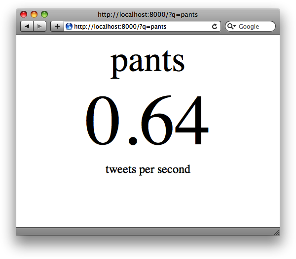

#第5章

**异步web服务**

**Asynchronous Web Services**

到这里，我们已经见识，令到Tornado成为开发web应用如此强大的框架的那些众多特性了。**Tornado的简单性、易用性及众多有用的帮助类、方法，就是令到其成为许多web项目很棒选择的原因**。不过，在谈到Tornado的特性时，讲得最多的就是其**内容异步获取及提供能力**，这是有原因的：**异步令到对非阻塞请求的处理变得容易，进而带来更为高效的处理以及更大的调度可能**（However, one of the most talked about features of Tornado, is its **ability to fetch and serve content asynchronously**, and with good reason: it makes it easy to handle nonblocking requests, ultimately resulting in more efficient processes and greater scaling possibilities）。本章中，就会探究一下Tornado中异步请求基础，以及一些允许你写出更简单的、可在使用较少资源的情况下，提供出更多请求的web应用的一些**长轮询**技巧（some long polling techniques）。

##异步web请求

**Asynchronous Web Requests**

大多数web应用（包括到目前为止我们研究的那些示例）本质上都是阻塞式的（are blocking in nature），意味着当正在处理一个请求时，直到该请求处理完毕，进程都是处于挂起中的。大多数情况下，经由Tornado所处理的web请求都应会很快完毕，所以这不会是一个问题。但是，对于那些需要一定时间的操作（像是大的数据库请求，或对外部APIs的调用），就意味着直到进程结束，应用都被有效锁定，这明显是个调度问题（a problem at scale）。

不过，Tornado给出了解决此类问题的一些更好方法。与其让一个进程在等待请求完成时挂起，应用可以启动一个请求处理，并给它一个在其完毕时用到的**回调函数**, 在等待首个进程完成时，**开放I/O循环给其他客户端以为其提供服务**（Instead of leaving a process hanging while it waits for a request to finish, the application can start a request and give it **a callback for when that completes**, **leaving the I/O open to serve other clients** while it waits for the first process to complete）。

为演示Tornado的异步特性，这里将建立一个向Twitter的搜索API发出HTTP请求的简单web应用。该web应用从查询字串获取到一个参数`q`，然后确定出带有该搜索词的tweet发出频率（tweets per second）。确定该数字的方法是很粗暴的，但用于示例目的也足够了。图5-1展示了该应用的样子。

**译者注：**原书是用Twitter的API，但国内是调用不到的，所以下面用weibo的API调用做演示。这里是该API接口文档：[http://open.weibo.com/wiki/2/search/topics](http://open.weibo.com/wiki/2/search/topics)

*图5-1, 异步HTTP示例，tweet频率*

将展示此应用的3个版本：第一个版本使用同步的HTTP请求，尔后的版本使用带有回调函数的Tornado的异步HTTP客户端。最后将展示如何来使用Tornado版本2.1的新的`gen`模块，来制作出更干净及更易于使用的异步HTTP请求（use Tornado 2.1's new `gen` module to make asynchronous HTTP requests cleaner and easier to implement）。

###第一个同步版本

**Starting Synchronous**

示例5-1包含了“tweet频率计算器“应用的同步版本源码。注意在顶部导入了Tornado的`httpclient`模块：将使用那个模块中的`HTTPClient`类执行HTTP请求。接着，将用到同意模块中的`AsyncHTTPClient`类。

*例5-1, 同步的HTTP请求：tweet_rate.py*
